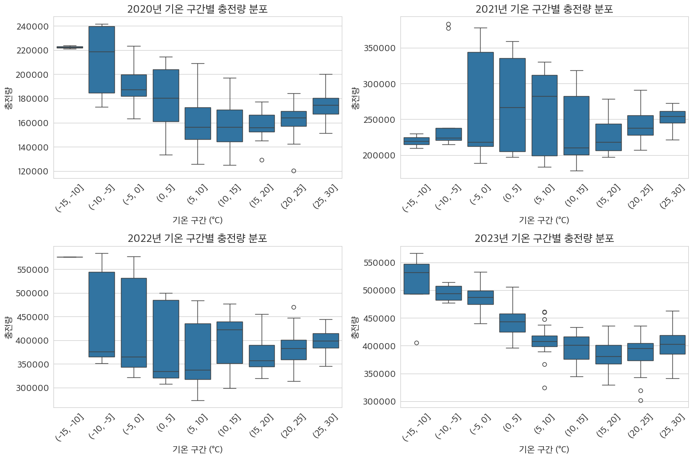
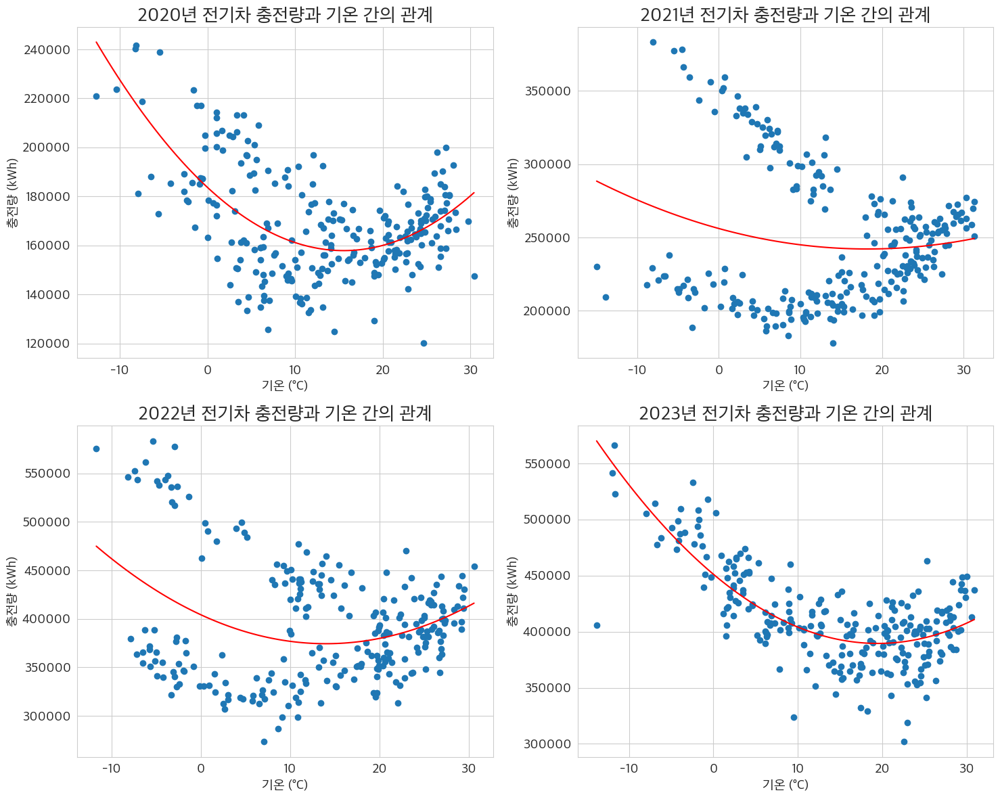
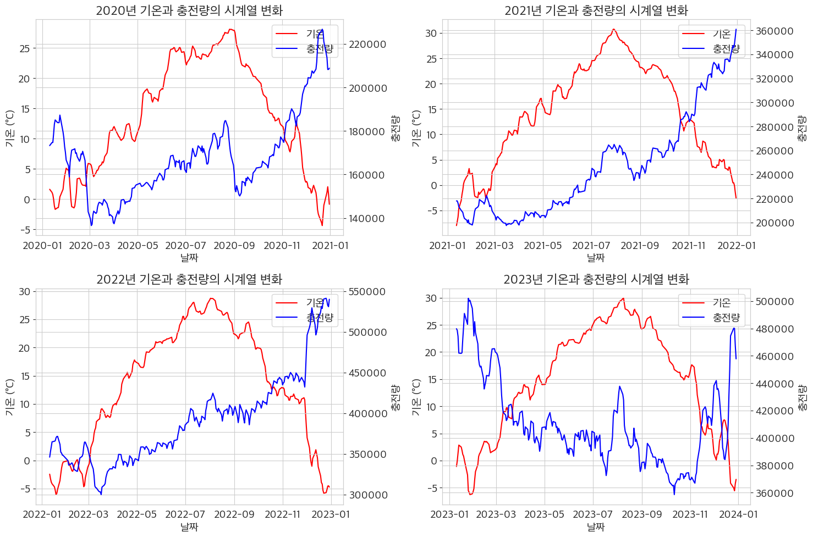
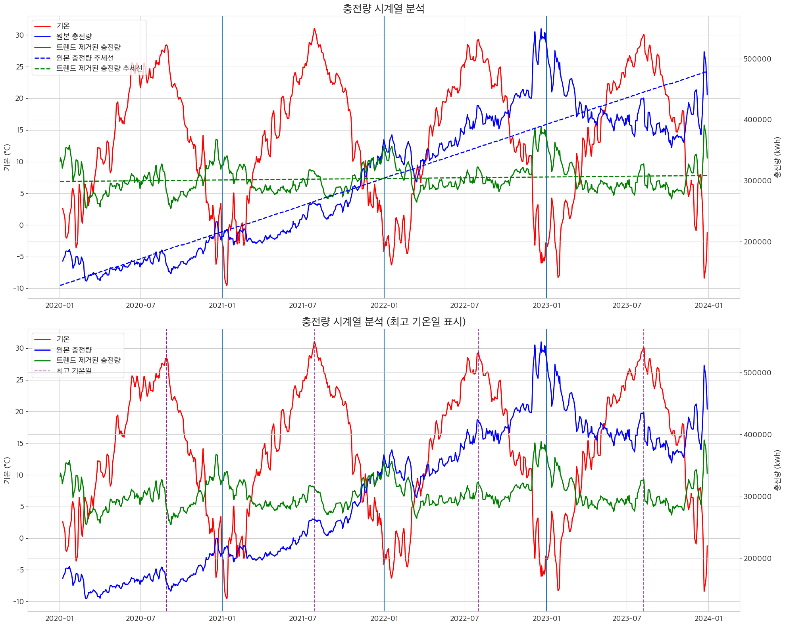
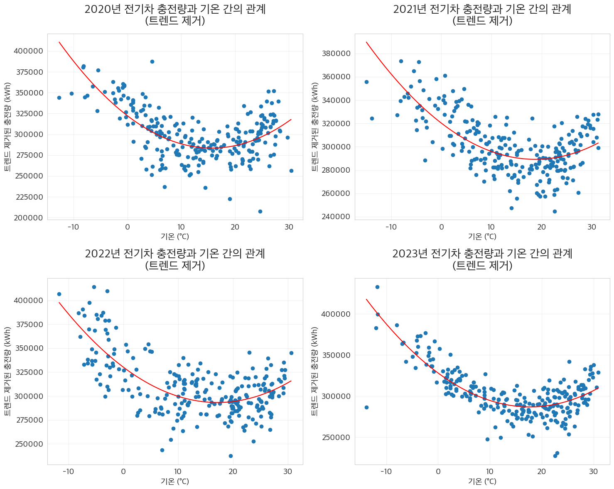
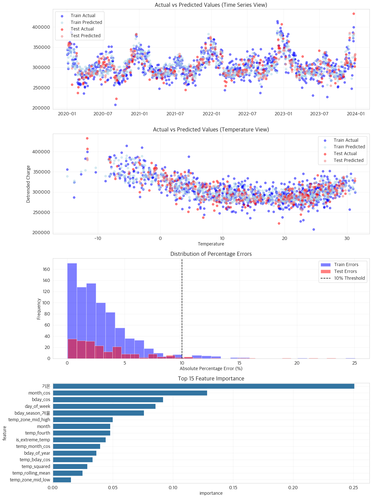

# 전기차 충전량과 기온 간의 관계 분석 및 머신러닝을 통한 전기차 충전량 예측

**단국대학교 24-2학기 POSE-AI 데이터사이언스 기말과제**

## 실행

24년 12월 10일에 릴리즈된 scikit-learn 1.6.0 버전에서  
`AttributeError: 'super' object has no attribute '__sklearn_tags__'` 에러가 발생합니다.

아래와 같이 버전을 맞춰 의존성을 설치하거나 `requirements.txt` 를 이용해서 의존성을 설치해주세요.

- scikit-learn==1.5.2
- xgboost==2.1.3

```
pip install -r requirements.txt
```

## 결과

### 데이터 시각화


<br/>

<br/>

<br/>

<br/>

<br/>

## 머신러닝 예측



## 모델 평가 지표

| 지표                    | 훈련 세트 | 테스트 세트 |
| ----------------------- | --------- | ----------- |
| **오차 지표**           | -         | -           |
| RMSE                    | 11638.25  | 14666.82    |
| MAE                     | 8765.28   | 10686.95    |
| MAPE                    | 2.94%     | 3.62%       |
| MSLE                    | 0.0016    | 0.0025      |
| **적합도 지표**         | -         | -           |
| R²                      | 0.828     | 0.761       |
| **허용 오차 기반 지표** | -         | -           |
| ±5% 이내                | 83.7%     | 78.1%       |
| ±10% 이내               | 97.1%     | 94.5%       |
| ±15% 이내               | 99.4%     | 98.0%       |
| ±20% 이내               | 99.8%     | 99.0%       |
